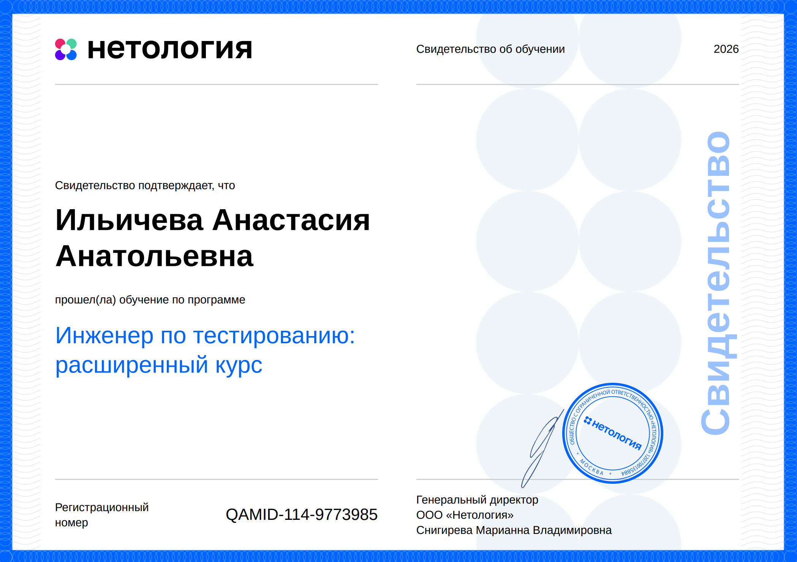

# 🎓 Образование и сертификаты

В этом репозитории собраны документы, подтверждающие мое обучение по направлению **QA Engineering**.

Здесь представлены диплом, свидетельства и сертификаты, полученные в процессе обучения и изучения технологий тестирования.

---

## 🎓 Основные документы

### Диплом о профессиональной переподготовке

Документ о профессиональной переподготовке по программе «Инженер по тестированию».

---

Свидетельство об успешном завершении образовательной программы Нетологии.

📄 [Скачать документ](./netology-qa-course-certificate.pdf)

  

---

## 📜 Сертификаты

### Автоматизация тестирования веб-интерфейсов

Изучение автоматизации UI-тестирования веб-приложений с использованием Selenium WebDriver.

📄 [Скачать сертификат](./web-automation-testing-cert.pdf)

  

---

### Автоматизированное тестирование

Изучение основ автоматизации тестирования, написания автотестов и работы с тестовыми фреймворками.

📄 [Скачать сертификат](./automated-testing-cert.pdf)

  

---

### Git — система контроля версий

Работа с Git и GitHub: ветвление, merge, pull request и командная разработка.

📄 [Скачать сертификат](./git-cert.pdf)

  

---

### Java для тестировщиков

Изучение языка Java, ООП, JUnit и разработки автоматизированных тестов.

📄 [Скачать сертификат](./java-cert.pdf)

  

  
   - 
